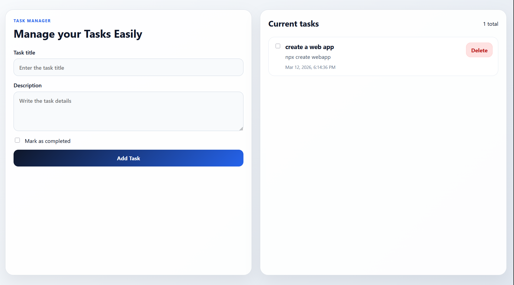

# Task Manager (Full Stack Application)

A simple **Task Manager application** built with:

- **Frontend:** Angular
- **Backend:** Django + Django REST Framework

The application allows users to **create, update, delete, and track tasks** with a completion checkbox.

---

# UI Preview

# Features

- Add new tasks
- View all tasks
- Delete tasks
- Mark tasks as completed
- RESTful API backend
- Angular frontend consuming Django API

---

# Tech Stack

## Backend
- Python
- Django
- Django REST Framework

## Frontend
- Angular
- TypeScript
- Angular HTTP Client

---

# Project Structure

---

# Backend Setup (Django + DRF)

## 1. Clone the repository

---

## 2. Install dependencies
pip install django djangorestframework
---

## 3. Run migrations
python manage.py migrate
---

## 4. Run backend server
python manage.py runserver
---

### 5. Backend will run at
http://127.0.0.1:8000

## For the FrontEnd :
In the Terminal Just go the frontend directory and just run the front end using these commands 
cd frontend
npm install
---

